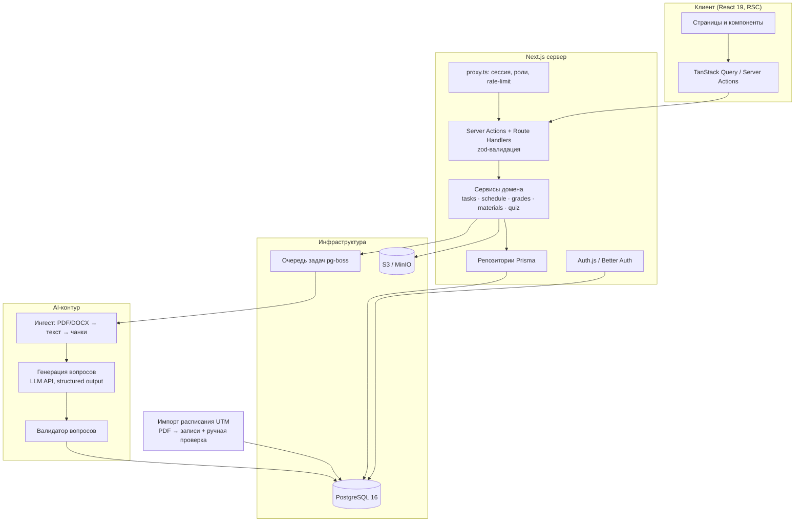
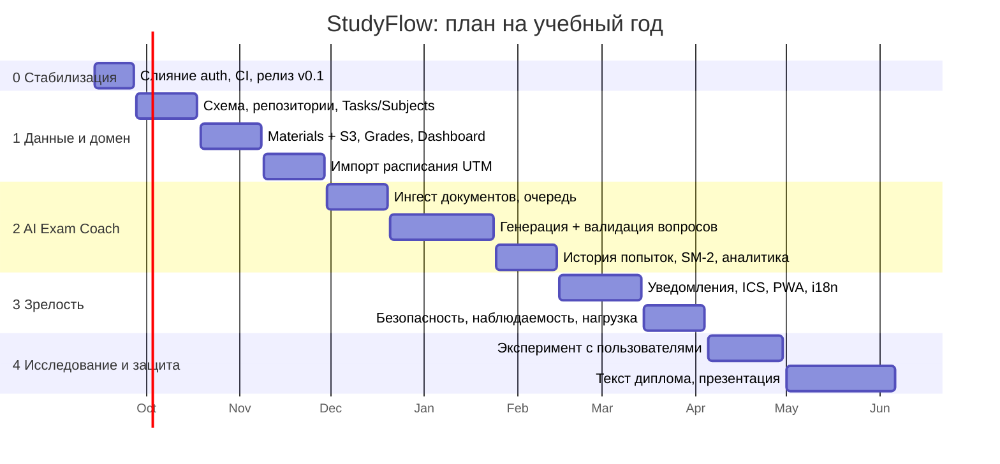

# StudyFlow: технический аудит и план развития

Срез: `origin/develop @ 98732c4`, 10 сентября 2026. Проанализированы все 17 удалённых веток и 56 коммитов. Локально проверено в изолированном worktree на Node 20.19.2: lint, tsc, build, юнит-тесты.

Стек: Next.js 16.3.4 · React 19.2.8 · Tailwind 4 · Prisma 7.10 · PostgreSQL 16.

---

## 0. Резюме

За семь дней (4–10 сентября 2026) команда из семи человек собрала **полный фронтенд-прототип** студенческого кабинета: дашборд, задания, расписание в трёх видах, калькулятор оценок, материалы, AI Exam Coach и страницу входа. Код опрятный, типизирован, проходит lint и сборку. Но это **витрина без сервера**: все данные захардкожены или живут в памяти вкладки, база данных подключена, но ни одна страница к ней не обращается, а «AI» выбирает вопросы из банка на 15 штук с искусственной задержкой 2,2 секунды.

| Область        | Оценка         | Комментарий                                             |
| -------------- | -------------- | ------------------------------------------------------- |
| Фронтенд       | готов          | 12 маршрутов, 5 850 строк TS/TSX                        |
| Бэкенд         | отсутствует    | 0 API-роутов в develop, Prisma не используется          |
| Аутентификация | в ветке        | `feature/backend/auth` не влита, отстаёт на 10 коммитов |
| Тесты в CI     | не запускаются | нет скрипта `test`, CI на Node 20 их бы и не выполнил   |
| Релиз          | нет            | `main` содержит один коммит и отстаёт на 51             |
| Гигиена веток  | 12 мёртвых     | полностью влиты, подлежат удалению                      |

**Главный вывод.** Для дипломной работы проекту не хватает не экранов, а _системы_: доменной модели, персистентности, реальной аутентификации, настоящего AI-контура и измеримого исследовательского вопроса. Всё это достижимо за один учебный год при дисциплине процесса, которая уже частично заложена в ветке `imurd` (строгий CI, интеграционный тест БД, Playwright, деплой-гейт).

> **Рекомендуемая тема диплома:** «Веб-платформа персонального планирования учёбы с генерацией контрольных вопросов на основе больших языковых моделей (на примере Технического университета Молдовы)». Исследовательское ядро: качество и педагогическая валидность автоматически сгенерированных вопросов, и влияние интервального повторения на результаты самопроверки.

---

## 1. Паспорт проекта

- **Назначение.** Личный кабинет студента Политехнического (Технического) университета Молдовы: расписание, дедлайны, оценки, материалы, подготовка к экзаменам.
- **Язык интерфейса.** Русский. Румынский и английский отсутствуют, хотя UTM двуязычный.
- **Название.** Не согласовано: `StudyHub` в метаданных и шапке (7 файлов), `StudyFlow` на странице входа и в имени пакета (2 файла).
- **История.** 56 коммитов, 14 pull request'ов влито в develop (#13–#36), первый коммит 4 сентября, последний 10 сентября 2026.
- **Команда.** 7 человек: AlinaKernus (20 коммитов: расписание, оценки, задания), hellomumu (11: AI Coach), Persik/FruktoviiFrukt (14: каркас, дашборд, auth-страница, CI), Anatolii Kretsu (4: инфраструктура БД, Auth.js), vlr404 (3: дизайн-система), Alshok27 (2: материалы), Anatoli D./Imurd (2: CI, автоматизация, тесты).
- **Размер.** 92 файла в develop; TS/TSX: app 1 277 строк, components 3 846, lib 724.
- **Зависимости.** next 16.3.4, react 19.2.8, tailwindcss 4, @prisma/client 7.10, lucide-react, Radix UI (dialog, progress, slot и монолитный `radix-ui`), class-variance-authority, clsx, tailwind-merge. В ветке auth добавлены next-auth 5.0.0-beta.32 и bcryptjs.
- **Инструменты.** ESLint 9 (next/core-web-vitals + typescript), Prettier, Husky + lint-staged, Docker Compose с PostgreSQL 16 на порту 5433.

### Что проверено вручную

| Проверка                       | Результат  | Комментарий                                                                                            |
| ------------------------------ | ---------- | ------------------------------------------------------------------------------------------------------ |
| `npm ci` (Node 20.19)          | ок         | 598 пакетов, `prisma generate` отработал                                                               |
| `npm run lint`                 | 0 ошибок   |                                                                                                        |
| `tsc --noEmit`                 | чисто      |                                                                                                        |
| `node --test tests/*.test.mjs` | 2/2 падают | Тесты импортируют `.ts` напрямую; Node 20 не умеет type-stripping. Нужен Node ≥ 22.6 или загрузчик tsx |
| `tsx --test tests/*.test.mjs`  | 11/11      | Логика тестов корректна, проблема только в окружении                                                   |
| `next build`                   | ок         | 12 маршрутов, 10 статических, 2 динамических (расписание)                                              |

---

## 2. Ветки и процесс разработки

Модель ветвления: `feature/* → develop` через PR с одним обязательным CI-джобом (lint + build). Ветка `main` ни разу не получала релиз.

| Ветка                      | Впереди / позади develop | Последний автор | Статус              | Рекомендация                                                                                                                                                                |
| -------------------------- | ------------------------ | --------------- | ------------------- | --------------------------------------------------------------------------------------------------------------------------------------------------------------------------- |
| `develop`                  | 0 / 0                    | FruktoviiFrukt  | интеграционная      | Источник правды. Защитить правилами ветки                                                                                                                                   |
| `main`                     | 0 / 51                   | FruktoviiFrukt  | пустая              | Первый релиз-merge из develop и тег `v0.1.0`                                                                                                                                |
| `feature/backend/auth`     | 1 / 10                   | Anatolii Kretsu | не влита, ценная    | Ребейз на develop, ревью, влить первой. Единственная ветка с реальным сервером                                                                                              |
| `feature/ui-design-system` | 1 / 34                   | vlr404          | конфликтует         | Дублирует Dialog/Progress/Select из `components/ui`. Забрать `empty-state`, `error-state`, `loading-indicator`, остальное закрыть                                           |
| `imurd`                    | 2 / 12                   | Anatoli D.      | параллельный контур | Перенести в develop: строгий CI, тесты schedule/ai-coach, интеграционный тест БД, Playwright, PR-шаблон. Авто-интеграцию и Vercel-деплой включать только после защиты веток |
| `feat/auth-page`           | 0 / 17                   | Persik          | влита               | Удалить                                                                                                                                                                     |
| `feature/ai-coach-page`    | 0 / 28                   | hellomumu       | влита               | Удалить                                                                                                                                                                     |
| `feature/ai-exam-coach`    | 0 / 16                   | hellomumu       | влита               | Удалить                                                                                                                                                                     |
| `feature/app-layout`       | 0 / 49                   | Persik          | влита               | Удалить                                                                                                                                                                     |
| `feature/dashboard`        | 0 / 48                   | Persik          | влита               | Удалить                                                                                                                                                                     |
| `feature/grades-page`      | 0 / 38                   | AlinaKernus     | влита               | Удалить                                                                                                                                                                     |
| `feature/materials-page`   | 0 / 8                    | Alshok27        | влита               | Удалить                                                                                                                                                                     |
| `feature/schedule-page`    | 0 / 43                   | AlinaKernus     | влита               | Удалить                                                                                                                                                                     |
| `feature/tasks-page`       | 0 / 8                    | AlinaKernus     | влита               | Удалить                                                                                                                                                                     |
| `feature/tasks-add/edit`   | 0 / 4                    | AlinaKernus     | влита               | Удалить. Слэш внутри имени ломает некоторые инструменты                                                                                                                     |
| `chore/code-quality`       | 0 / 38                   | Persik          | влита               | Удалить                                                                                                                                                                     |
| `chore/github-actions-ci`  | 0 / 36                   | Persik          | влита               | Удалить                                                                                                                                                                     |

### Наблюдения по процессу

- **Скорость высокая, интеграция частая.** 14 PR за 7 дней, конфликтов почти нет, потому что каждый работает в своей папке. Это перестанет работать, как только появится общая модель данных.
- **Три несогласованных требования к Node.** CI на develop: Node 20. README: «Prisma 7 требует Node 22 LTS». Ветка imurd: `.node-version` = 24.14.0 и `engines: 24.x`.
- **Два контура аутентификации.** Страница входа (влита) только пишет данные в `console.log`. Реальная реализация с Auth.js лежит в отдельной ветке и уже отстаёт.
- **Нет владельца релиза.** main пуст, тегов нет, CHANGELOG нет.
- **Ветка imurd как «второй develop».** Идея строгого CI и деплой-гейта правильная, но применена к личной ветке; её место в develop и в настройках защиты ветки.

---

## 3. Архитектура текущего состояния

Приложение целиком клиентское поверх Next.js App Router. Серверный код исполняется только для рендера страниц. Слой `lib/` содержит чистые функции и демо-фикстуры, а не доступ к данным.

```mermaid
flowchart LR
  subgraph Browser["Браузер"]
    D[Dashboard]
    T[Tasks]
    S[Schedule ×3]
    G[GPA]
    M[Materials]
    A[AI Coach]
    AU[Auth page]
  end
  subgraph Lib["lib/ (чистые функции + фикстуры)"]
    LT[tasks.ts валидация]
    LG[grades.ts парсер формул]
    LS[schedule.ts даты, demoWeek]
    LA[ai-coach.ts, mockQuiz.ts]
  end
  subgraph Server["Сервер Next.js"]
    R[RSC-рендер страниц]
    P[lib/prisma.ts]
  end
  DB[(PostgreSQL 16<br/>таблица User)]
  T --> LT
  G --> LG
  S --> LS
  A --> LA
  D -. хардкод .-> D
  AU -. console.log .-> AU
  R --> Browser
  P -. никто не импортирует .-> DB
```

### Что сделано хорошо

- **Чистое разделение UI и логики** там, где логика есть: валидация заданий, парсер формул оценок и утилиты дат живут в `lib/` и покрыты тестами.
- **Безопасный парсер формул** в `lib/grades.ts`: рекурсивный спуск с процентами, скобками и приоритетом, без `eval`, с ограничением длины и диапазона результата.
- **Корректная работа с датами расписания**: часовой пояс Europe/Chisinau, date-only арифметика в UTC (переход на летнее время не сдвигает неделю), `force-dynamic` для «сегодня».
- **Доступность**: aria-атрибуты, фокус на первой ошибке формы, `aria-live` для статуса формулы, клавиатурная навигация в мобильном меню.
- **Компонентная база** на Radix + CVA с токенами shadcn в `globals.css`.

### Что архитектурно отсутствует

- Слой доступа к данным: ни одного Route Handler, Server Action или репозитория.
- Доменная модель: единственная сущность в Prisma это `User`.
- Идентичность пользователя: все страницы показывают «Student / student@utm.md».
- Хранилище файлов: материалы держатся в памяти как объекты `File`.
- AI-контур: нет вызова модели, извлечения текста из PDF/DOCX, хранения попыток.
- Наблюдаемость и безопасность: нет логирования, rate-limit, security-заголовков, CSP.

---

## 4. Разбор модулей

### 4.1 Dashboard

Серверный компонент со статическими массивами. Числа в карточках («12 выполнено», «18 файлов») не связаны ни с чем. Перевести на агрегаты из БД: занятия на сегодня по группе, ближайшие дедлайны, доля выполненных заданий.

### 4.2 Задания (Tasks)

Самый зрелый модуль по UX: три статуса, приоритеты, фильтры, прогресс по предмету, диалог с валидацией, подтверждение удаления, управление предметами.

- Файл страницы 765 строк с собственным `CustomSelect`, хотя `components/ui/select.tsx` уже существует.
- Идентификаторы `number` с `Math.max + 1`.
- Список предметов дублируется в 6 файлах.
- «Просрочено» считается по локальному времени браузера, расписание по времени университета.

### 4.3 Расписание (Schedule)

Три представления: личное, аттестации/экзамены, глобальное. Утилиты дат корректны и протестированы. Данные: `demoWeek` из 14 шаблонных занятий; глобальное расписание генерируется процедурно из списка групп 3-го курса (`public/schedules/year-3-semester-5.pdf`).

- Импорт расписания из PDF UTM может стать самостоятельным инженерным разделом диплома.
- Не хватает понятий: семестр, чётность недели, подгруппа, исключения.

### 4.4 Средний балл (GPA)

Пять этапов с весами 15/15/15/15/40 и редактируемой формулой. Хорошие тесты на границы, деление на ноль, инъекции.

- Хранение только в состоянии компонента.
- Роль преподавателя упоминается в коммитах, но в Prisma только `STUDENT` и `ADMIN`.

### 4.5 Материалы (Materials)

Drag-and-drop до 50 МБ, группировка, поиск, открытие через `URL.createObjectURL`. Кнопка «Подготовить с ИИ» ведёт на `/ai-coach?material=…`, но параметр никто не читает.

- Нужно S3-совместимое хранилище и таблица `Material`.
- Вторая копия `formatFileSize` с другим округлением.

### 4.6 AI Exam Coach

Трёхшаговый сценарий работает, проблема в содержимом.

- `handleGenerate` ждёт 2,2 с и берёт вопросы из банка на 15 штук; при 20 вопросах дублирует с суффиксом `-r1`. Файл не читается.
- `QuestionType` определён дважды с разными значениями.
- Нет хранения попыток: «Проработать слабые темы» перезапускает тот же тест.

### 4.7 Аутентификация

**В develop:** страница без обработчиков, сабмит в консоль, «Выйти» это ссылка.
**В feature/backend/auth:** Auth.js v5 (beta), Credentials + bcrypt, JWT, роут регистрации, `proxy.ts` с редиректами, сид администратора, типизация сессии с ролью.

- Замечания: email не нормализуется, нет rate-limit, невалидный JSON даст 500, пароль администратора `admin123` по умолчанию должен падать в production. Нет восстановления пароля.
- next-auth 5 всё ещё beta; зафиксировать решение в ADR.

### 4.8 Инфраструктура и CI

- Docker Compose с PostgreSQL на 5433, Prisma 7 с `@prisma/adapter-pg`, миграция `init`.
- CI на develop: lint + build, без тестов и typecheck. Ветка imurd содержит целевой вариант: Quality, Database (реальный Postgres), Browser (Playwright), деплой-гейт по SHA.

---

## 5. Качество и инженерия

### Тестирование

| Уровень          | develop                                | imurd                                 | Цель                                         |
| ---------------- | -------------------------------------- | ------------------------------------- | -------------------------------------------- |
| Юнит (node:test) | 2 файла, 11 тестов; скрипта `test` нет | + schedule (4), ai-coach (1); Node 24 | Покрытие `lib/` и сервисов; порог 80% в CI   |
| Интеграция БД    | нет                                    | 1 тест                                | Тест на каждую миграцию и репозиторий        |
| E2E (Playwright) | нет                                    | 4 сценария                            | Смоук на каждый маршрут + критические потоки |
| Контракты API    | нет                                    | нет                                   | zod → OpenAPI                                |
| AI-качество      | нет                                    | нет                                   | Golden-набор, метрики валидности (раздел 10) |

### Стиль и консистентность

- Два стиля форматирования; глобального `prettier --check` в CI нет.
- `inputClass` скопирован в четырёх файлах вместо компонента `Input`.
- Смешение токенов shadcn и прямых классов Tailwind; тёмная тема не реализована, но классы `dark:` есть.
- `globals.css` ссылается на переменные Geist, макет их не подключает; тело набрано Arial.

### Безопасность

- Пока нет сервера, поверхность минимальна. Парсер формул и валидация сделаны с оглядкой на инъекции.
- После слияния auth: rate-limit на `/api/auth/*`, нормализация email, zod, CSP/HSTS, проверка владельца на каждом запросе, аудит зависимостей в CI.

---

## 6. Реестр находок

Приоритет: **P1** блокирует развитие · **P2** технический долг · **P3** гигиена.

| ID   | P   | Находка                                                                                                                                                              | Исправление                                                                    |
| ---- | --- | -------------------------------------------------------------------------------------------------------------------------------------------------------------------- | ------------------------------------------------------------------------------ |
| F-01 | P1  | В `components/ui/input.tsx` и `select.tsx` `import { cn } from "cn"` — сторонний npm-пакет, а не `lib/utils`. Сборка проходит, потому что компоненты не используются | Заменить на `@/lib/utils`, удалить пакет `cn`, правило `no-restricted-imports` |
| F-02 | P1  | Тесты не входят в CI и не запускаются на Node 20                                                                                                                     | Перенести из imurd `.node-version`, скрипты, три CI-джоба                      |
| F-03 | P1  | Аутентификация расщеплена на две ветки                                                                                                                               | Ребейз и слияние `feature/backend/auth` в первую неделю                        |
| F-04 | P1  | Нет релиза и защиты веток                                                                                                                                            | Branch protection, release-merge в main, тег `v0.1.0`, CHANGELOG               |
| F-05 | P2  | Prisma подключена, но мертва                                                                                                                                         | Полная схема (раздел 8), первые репозитории                                    |
| F-06 | P2  | Предметы захардкожены в шести местах, списки расходятся                                                                                                              | Сущность Subject в БД                                                          |
| F-07 | P2  | StudyHub против StudyFlow                                                                                                                                            | Решить командой, заменить 9 вхождений                                          |
| F-08 | P2  | Дубли: две `formatFileSize`, два `QuestionType`, четыре `inputClass`, свой `CustomSelect`, дубли в ui-design-system                                                  | `lib/format.ts`, `components/ui`, закрыть ветку                                |
| F-09 | P2  | `?material=` формируется, но не читается                                                                                                                             | В фазе 2 материал становится источником генерации                              |
| F-10 | P2  | Три версии требований к Node                                                                                                                                         | Один `.node-version` (22 LTS), `engines`, CI через `node-version-file`         |
| F-11 | P3  | 12 влитых веток не удалены                                                                                                                                           | Удалить, включить auto-delete                                                  |
| F-12 | P3  | Монолитный `radix-ui` рядом с `@radix-ui/*`                                                                                                                          | Оставить точечные пакеты                                                       |
| F-13 | P3  | Шрифт и токены темы объявлены, но не применены                                                                                                                       | `next/font`; решить про тёмную тему                                            |

---

## 7. Целевая архитектура

Остаться в одном репозитории и одном рантайме Next.js, но ввести явные слои. Отдельный сервис оправдан только для обработки документов и вызовов модели.



### Ключевые решения (кандидаты в ADR)

| Решение        | Рекомендация                                                                                                    | Почему                                        |
| -------------- | --------------------------------------------------------------------------------------------------------------- | --------------------------------------------- |
| Транспорт      | Server Actions для мутаций, Route Handlers для файлов                                                           | Типобезопасность end-to-end                   |
| Валидация      | zod-схемы в `lib/schemas`, общие для клиента и сервера                                                          | Убирает дубли, даёт OpenAPI                   |
| Аутентификация | Auth.js v5 с планом миграции на Better Auth, если beta не стабилизируется к декабрю                             | Не переписывать готовое                       |
| Файлы          | S3-совместимое, presigned URL, локально MinIO                                                                   | Не держать байты в Postgres                   |
| Фоновые задачи | pg-boss поверх PostgreSQL                                                                                       | Без Redis                                     |
| Модель         | Сильная модель для генерации, компактная для валидации; structured output по JSON-схеме; провайдер за адаптером | Качество против стоимости                     |
| Хостинг        | Vercel + Neon/Supabase + Cloudflare R2                                                                          | Бесплатные тарифы покрывают дипломный масштаб |
| Локализация    | next-intl, ru/ro/en, фаза 3                                                                                     | UTM двуязычен                                 |

---

## 8. Модель данных

```mermaid
erDiagram
  User ||--o{ Enrollment : has
  User ||--o{ Task : owns
  User ||--o{ Material : uploads
  User ||--o{ GradeEntry : records
  User ||--o{ QuizAttempt : takes
  Group ||--o{ Enrollment : includes
  Group ||--o{ TimetableEntry : follows
  Subject ||--o{ TimetableEntry : taught_in
  Subject ||--o{ Task : for
  Subject ||--o{ Material : about
  Subject ||--o{ GradeScheme : graded_by
  GradeScheme ||--o{ GradeStage : consists_of
  GradeStage ||--o{ GradeEntry : filled_as
  Material ||--o{ DocumentChunk : split_into
  Material ||--o{ Quiz : source_of
  Quiz ||--o{ Question : contains
  Quiz ||--o{ QuizAttempt : attempted
  QuizAttempt ||--o{ Answer : has
  Question ||--o{ Answer : answered
  Question ||--o{ ReviewCard : scheduled_as
  User { string id PK; string email UK; string passwordHash; string name; enum role "STUDENT ADMIN TEACHER"; string locale }
  Group { string id PK; string code "TI-241"; int year; string faculty }
  Subject { string id PK; string name; string color; int semester }
  TimetableEntry { string id PK; int weekday; int slot; enum weekParity "ALL ODD EVEN"; enum kind "LECTURE LAB SEMINAR EXAM"; string room; string teacher; date validFrom; date validTo }
  Task { string id PK; string title; enum status; enum priority; date dueDate; text notes }
  Material { string id PK; string title; string storageKey; string mime; int size; string sha256; enum ingestStatus }
  DocumentChunk { string id PK; int ordinal; text content; vector embedding "optional pgvector" }
  GradeScheme { string id PK; string formula }
  GradeStage { string id PK; string variable; string name }
  GradeEntry { string id PK; decimal value }
  Quiz { string id PK; enum difficulty; enum questionType; string model; string promptVersion }
  Question { string id PK; text stem; json options; string correctOptionId; string topic; text explanation; text sourceExcerpt; float validatorScore }
  QuizAttempt { string id PK; datetime startedAt; datetime finishedAt; int score }
  Answer { string id PK; string selectedOptionId; bool isCorrect; int timeMs }
  ReviewCard { string id PK; date dueOn; float easiness; int interval; int repetitions }
```

Замечания:

- **Enrollment** связывает студента с группой по семестру; расписание берётся через группу.
- **TimetableEntry** с `validFrom/validTo` и чётностью недели заменяет `demoWeek`. Исключения (перенос пары) — отдельная таблица во фазе 3.
- **GradeScheme** хранит формулу на предмет; парсер из `lib/grades.ts` переиспользуется на сервере.
- **DocumentChunk.embedding** опционален: pgvector включать только если эксперимент покажет выигрыш RAG.
- **ReviewCard** реализует SM-2 для интервального повторения.
- Поля `model`, `promptVersion`, `sourceExcerpt`, `validatorScore` нужны для воспроизводимости эксперимента.

---

## 9. Дорожная карта

> **Допущение о сроках.** План рассчитан на учебный год 2026/27 с защитой в июне 2027. Если защита в январе, фазы 3 и 4 сжимаются до одной.



### Фаза 0 · 14–27 сентября 2026 · Стабилизация

Цель: один источник правды, зелёный CI, первый релиз.

- Влить `feature/backend/auth` после ребейза и правок из 4.7.
- Перенести из imurd: `.node-version`, скрипты, три CI-джоба, PR-шаблон, тесты, Playwright.
- Исправить F-01, F-06 (временная общая константа), F-07, F-08.
- Удалить 12 мёртвых веток, включить защиту develop и main.
- Release-merge в main, тег v0.1.0, CHANGELOG, ADR-001 (auth), ADR-002 (Node/CI).

**Критерий выхода:** вход и регистрация работают на деплое; CI с тестами обязателен для merge; main = develop.

### Фаза 1 · 28 сентября – 29 ноября 2026 · Данные и домен

Цель: каждый экран читает и пишет в PostgreSQL от имени пользователя.

- Миграция полной схемы, сид с реальными предметами и группами FCIM.
- Subject и Task: server actions, оптимистичные обновления, удаление хардкода.
- Materials: MinIO, presigned upload, метаданные в БД, серверные ограничения.
- Grades: GradeScheme/GradeEntry, серверный расчёт, история.
- Dashboard: агрегаты.
- Расписание: TimetableEntry по группе; импортёр PDF UTM с экраном ручной проверки.
- Роли TEACHER и ADMIN, минимальная админка.

**Критерий выхода:** ни одного `INITIAL_*` и `demo*` в коде страниц; интеграционные тесты на каждый репозиторий; e2e на вход → задание → материал.

### Фаза 2 · 30 ноября 2026 – 14 февраля 2027 · Настоящий AI Exam Coach

Цель: из загруженного конспекта получаются валидные вопросы, результаты сохраняются и влияют на следующий тест.

- Ингест: PDF/DOCX → текст → чанки 1–2 тыс. токенов, `ingestStatus`, очередь pg-boss.
- Генерация: промпт с педагогической рамкой (таксономия Блума), structured output по схеме Question, обязательные `explanation` и `sourceExcerpt`.
- Валидация: второй проход моделью (правильность по источнику, единственность ответа, качество дистракторов), порог, лог отклонённых.
- Попытки и ответы в БД; «Проработать слабые темы» генерирует по слабым темам.
- SM-2 карточки и раздел «На сегодня».
- Стоимость: кэш по sha256 + параметрам, дневной лимит, учёт токенов.

**Критерий выхода:** на golden-наборе из 10 конспектов ≥ 85% вопросов проходят валидатор и ≥ 80% признаются корректными двумя преподавателями; p95 генерации 10 вопросов ≤ 30 с.

### Фаза 3 · 15 февраля – 4 апреля 2027 · Зрелость продукта

- Уведомления о дедлайнах (email через Resend, Web Push).
- Экспорт в ICS, подписка календаря.
- PWA с офлайн-кэшем расписания.
- next-intl ru/ro/en; тёмная тема через токены.
- Rate-limit, CSP, аудит зависимостей, OWASP ASVS L1.
- Структурные логи, Sentry, k6 на 200 пользователей.
- Аудит axe, WCAG 2.1 AA.

**Критерий выхода:** Lighthouse ≥ 90 по всем категориям на мобильном; 0 критических находок axe; отчёт по безопасности.

### Фаза 4 · 5 апреля – 6 июня 2027 · Исследование и защита

- Пилот с 1–2 группами (20–40 студентов) в течение 3 недель, согласие на обработку данных.
- Сбор метрик, SUS, интервью.
- Заморозка, релиз v1.0, документация.
- Текст диплома, презентация, демо-стенд.

**Критерий выхода:** диплом сдан, приложение развёрнуто, тег v1.0 с воспроизводимой инструкцией.

---

## 10. Исследовательская часть диплома

### Гипотеза A. Качество автоматически сгенерированных вопросов

- **Вопрос:** какая стратегия даёт больше валидных вопросов при одинаковом бюджете: (1) полный конспект в контекст, (2) RAG по чанкам, (3) генерация + отдельный валидатор.
- **Данные:** golden-набор из 10 конспектов по 5 предметам, по 20 вопросов на конспект и стратегию, около 600 вопросов.
- **Метрики:** доля прошедших валидатор; доля корректных по оценке двух преподавателей (каппа Коэна); распределение по уровням Блума; доля «утечки ответа»; стоимость и латентность.
- **Метод:** слепая экспертная оценка по рубрике из 5 критериев; хи-квадрат по долям, доверительные интервалы.

### Гипотеза B. Эффект интервального повторения

- **Вопрос:** повышает ли SM-2 точность на отложенном тесте через 2 недели по сравнению со свободной самопроверкой.
- **Дизайн:** две группы внутри пилота, одинаковый материал, контроль через 14 дней; t-критерий или Манна–Уитни, размер эффекта Коэна.
- **Ограничения:** малая выборка, самоотбор.

### Продуктовые метрики пилота

| Метрика                            | Как измеряется         | Цель                            |
| ---------------------------------- | ---------------------- | ------------------------------- |
| Удержание WAU / зарегистрированные | События входа          | ≥ 50% за 3 недели               |
| Доля заданий, закрытых до дедлайна | Task.status и dueDate  | Рост против первой недели       |
| Тестов пройдено на пользователя    | QuizAttempt            | ≥ 3                             |
| SUS                                | Опросник из 10 пунктов | ≥ 70                            |
| Стоимость генерации                | Токены × тариф         | ≤ 0,05 $ на тест из 10 вопросов |

---

## 11. Риски и меры

| Риск                                      | Вероятность | Влияние | Мера                                                                                        |
| ----------------------------------------- | ----------- | ------- | ------------------------------------------------------------------------------------------- |
| next-auth 5 остаётся в beta               | средняя     | среднее | Изолировать за `lib/auth`; ADR с планом миграции; проверка в декабре                        |
| Команда разойдётся после первого семестра | высокая     | высокое | Фазы 0–1 всей командой, фазы 2–4 рассчитаны на 1–2 человек; CODEOWNERS                      |
| Расписание UTM в PDF меняет формат        | высокая     | среднее | Импортёр с ручной проверкой; хранить исходный PDF                                           |
| Стоимость и лимиты API модели             | средняя     | среднее | Кэш по хэшу, дневной лимит, компактная модель для валидации, учёт токенов                   |
| Персональные данные студентов             | средняя     | высокое | Минимизация, шифрование at rest, удаление аккаунта, согласие в пилоте                       |
| Next.js 16 / React 19 быстро обновляются  | средняя     | низкое  | Renovate еженедельно, только при зелёном CI                                                 |
| Галлюцинации модели в вопросах            | высокая     | высокое | Обязательный `sourceExcerpt`, валидатор, «пожаловаться на вопрос», отчёт о доле отклонённых |

---

## 12. Отображение на структуру диплома

| Глава                        | Содержание                                                                              | Источник в проекте                       |
| ---------------------------- | --------------------------------------------------------------------------------------- | ---------------------------------------- |
| 1. Анализ предметной области | Проблемы студента UTM, аналоги (Moodle, Notion, Google Classroom, Anki), требования     | Этот аудит, интервью                     |
| 2. Проектирование            | Архитектура, ADR, ER-модель, API-контракты, UI-система, безопасность                    | Разделы 7–8, `docs/adr/*`, zod-схемы     |
| 3. Реализация                | Слои, парсер формул, импорт расписания, ингест, генерация и валидация, SM-2             | Код фаз 1–2                              |
| 4. Тестирование и качество   | Пирамида тестов, CI, покрытие, нагрузка, доступность, безопасность                      | Раздел 5, отчёты CI, Playwright, k6, axe |
| 5. Исследование              | Методика, golden-набор, экспертная оценка, пилот, статистика, ограничения               | Раздел 10, таблицы Quiz/Question/Attempt |
| 6. Экономическая часть       | Стоимость хостинга и API, трудозатраты, сравнение с готовым решением                    | Учёт токенов, тарифы                     |
| Заключение                   | Итоги; не вошло: TimetableException, мобильное приложение, интеграция с ИС университета |                                          |

---

## 13. Что сделать в первые две недели

Список PR в порядке слияния; каждый на один день работы одного человека.

1. **chore: node and scripts.** `.node-version` = 22, `engines`, скрипты `test`, `typecheck`, `format:check`. Перенос тестов schedule и ai-coach из imurd.
2. **ci: quality, database, browser.** Три джоба из imurd с триггером на develop и main; Playwright и интеграционный тест БД. Branch protection.
3. **fix: cn import and dead deps.** F-01, удаление `cn` и `radix-ui`, правило `no-restricted-imports`.
4. **feat: auth (rebase of feature/backend/auth).** Плюс нормализация email, zod, обработка невалидного JSON, запрет дефолтного пароля администратора в production.
5. **refactor: shared subjects and formatters.** `lib/subjects.ts`, `lib/format.ts`, удаление дублей `inputClass` через `components/ui/input.tsx`.
6. **chore: product name.** Замена StudyHub/StudyFlow, метаданные, favicon, README про продукт вместо шаблона create-next-app.
7. **docs: ADR-001 auth, ADR-002 toolchain, CONTRIBUTING, CODEOWNERS.**
8. **release: v0.1.0.** Merge develop → main, тег, CHANGELOG, деплой на Vercel.
9. **chore: delete merged branches**; закрыть feature/ui-design-system после переноса трёх компонентов.
10. **feat: prisma schema v1.** Полная схема из раздела 8 одной миграцией и сид; открывает фазу 1.
